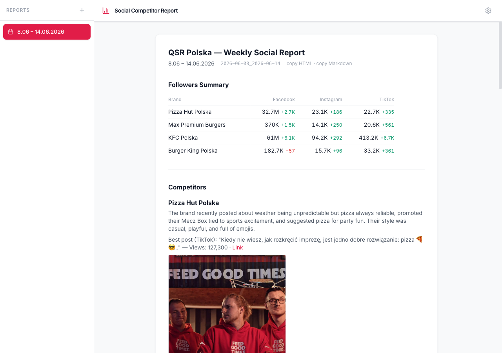
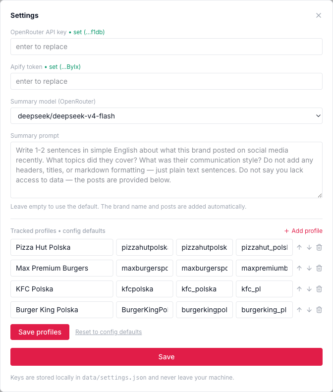
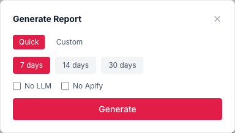

# social-competitor-report

**Weekly social-media competitor intelligence across Instagram, TikTok & Facebook.**

Point it at a set of brand accounts and it produces a weekly report: who posted what,
each brand's best post, a full table of every post in the period, and week-over-week
follower growth — viewable in a clean web dashboard and exportable to Markdown / HTML.

The demo ships pre-configured to track four Polish QSR brands — **Pizza Hut,
Max Premium Burgers, KFC, Burger King** — but any brands work: change them in the
dashboard or in one config file, no code edits.

It runs on two API keys (Apify + OpenRouter) that you paste straight into the
dashboard's Settings panel — no `.env` file required.



<table>
<tr>
<td width="50%"></td>
<td width="50%"></td>
</tr>
<tr>
<td align="center"><em>Settings — keys, model, AI prompt &amp; tracked profiles (stored locally)</em></td>
<td align="center"><em>Generate a report for any date range</em></td>
</tr>
</table>

---

## Run it — the simple way (no experience needed)

You only need to do the setup once. Commands are meant to be copy-pasted into a
terminal (on macOS/Linux: "Terminal"; on Windows: "PowerShell").

**1. Install the two free tools the app needs:**

- **Python 3.11 or newer** → <https://www.python.org/downloads/>
- **Node.js (LTS)** → <https://nodejs.org/>

(Accept the defaults in both installers. To check they worked, run `python3 --version`
and `node --version` — each should print a version number.)

**2. Download this project:**

```bash
git clone https://github.com/<your-username>/social-competitor-report.git
cd social-competitor-report
```

(No git? Click the green **Code → Download ZIP** button on GitHub, unzip it, and open a
terminal inside the unzipped folder.)

**3. One-time setup (installs everything the app uses):**

```bash
python3 -m venv .venv
.venv/bin/pip install -r requirements.txt -r dashboard/backend/requirements.txt
cd dashboard/frontend && npm install && cd ../..
```

**4. Start the app:**

```bash
bash dashboard/start.sh
```

Then open **<http://localhost:5003>** in your browser. (To stop it later:
`bash dashboard/stop.sh`.)

**5. Add your keys and make a report:**

- Click the **gear icon** (top-right) and paste in your two keys (see below for where to
  get them). Click **Save**.
- Click **Generate report** (top-left), pick a date range, and click **Generate**.

That's it. Your report appears in the sidebar; open it to browse, or use the copy
buttons to export it as HTML or Markdown.

### The two keys you'll need

| Key | What it's for | Where to get it | Looks like |
|-----|---------------|-----------------|-----------|
| **OpenRouter** | the AI that writes each brand's summary | <https://openrouter.ai/settings/keys> | `sk-or-v1-…` |
| **Apify** | scrapes Instagram / TikTok / Facebook | <https://console.apify.com/account/integrations> | `apify_api_…` |

> **Cost:** Apify bills per scrape — roughly **$0.4–0.6 for one full weekly report**
> (4 brands × 3 platforms). The AI summaries cost a fraction of a cent. Both services
> offer free starting credit, so you can try it for free.

> **Prefer a file over the Settings panel?** Copy `.env.example` to `.env` and fill in the
> two keys there instead. The Settings panel and `.env` both work; Settings wins if both
> are set.

---

## Features

- **Multi-platform scraping** — Instagram, TikTok and Facebook for every brand, in
  four parallel Apify actor runs (IG, TikTok, FB page followers, FB posts).
- **Per-brand AI summary** — a short, neutral content recap written by an LLM of your
  choice (any OpenRouter model). You can edit the exact prompt in Settings.
- **Best post + full posts table** — the standout post per brand, plus a table of
  *every* post in the period with its stats (likes / comments / shares / views).
- **Follower tracking** — week-over-week deltas per platform, with a cross-brand summary.
- **Web dashboard** — browse past reports, generate new ones with live progress, and
  copy the report to clipboard as styled HTML (for Slack/Lark/docs) or Markdown.
- **Edit everything in-app** — store your OpenRouter key, Apify token, chosen model and
  AI prompt, and add/remove/reorder the **tracked profiles**, all from the Settings
  panel. Secrets are stored locally and never returned by the API.
- **Resilient pipeline** — every step is isolated; one failed brand or LLM call never
  aborts the run, and the failure is recorded in a generation log.

## Architecture

```
                ┌──────────────┐
   config.yaml  │  Collectors  │  Apify (IG / TikTok / FB), 4 parallel actor runs
   (brands)  ─► │  Processors  │  best post, follower deltas, LLM summary (OpenRouter)
                │  Writers     │  Markdown report + per-brand data JSON + images
                └──────┬───────┘
                       │  reports/{id}/report.md  +  reports/{id}/data/*.json
            ┌──────────┴───────────┐
     CLI (generate_report.py)   Web dashboard (FastAPI + React)
```

- **Pipeline** lives in `run_pipeline()` (`generate_report.py`); the CLI and the
  dashboard both call it.
- Reports are **folder-per-report** on disk: `reports/{YYYY-MM-DD_YYYY-MM-DD}/report.md`
  plus `data/*.json` (raw scraped data) and `images/` (downloaded best-post covers).
- The dashboard **parses the markdown** for text and reads the **structured JSON** for
  the full post tables and follower numbers.

## Tech stack

Python 3.11+ · FastAPI · uvicorn · Apify · OpenRouter (via the `openai` SDK) ·
React 19 · Vite 7 · Tailwind CSS 4 · Zustand · pytest.

## CLI usage

The dashboard is the easy way, but you can also run it from the command line:

```bash
.venv/bin/python generate_report.py                                   # last 7 days
.venv/bin/python generate_report.py --start-date 2026-06-08 --end-date 2026-06-14
.venv/bin/python generate_report.py --no-llm --skip-apify             # dry run ($0)
```

## Choosing which brands to track

The easiest way is the **Settings → Tracked profiles** panel in the dashboard: add,
remove or reorder brands and hit *Save profiles* (saved locally, no code changes).

You can also edit `config.yaml` directly — it's the default set used when no in-app
override exists:

```yaml
report_title: "Competitor Brands — Weekly Social Report"
competitors:
  - name: "Pizza Hut Polska"
    facebook_page: "pizzahutpolska"      # the facebook.com/<page> slug
    instagram_handle: "pizzahutpolska"   # the @username
    tiktok_handle: "pizzahut_polska"     # the @handle
  # … add as many brands as you like
```

> **Tip:** Facebook follower counts for big international brands are often the *global*
> number (Facebook "Global Pages"), not the local one. Prefer a brand's local-market
> page slug when one exists.

## Demo report

This repo ships **one real generated report** (under `reports/`) so you can see the
output immediately, before adding any keys. Its week-over-week follower deltas are seeded
against an illustrative baseline; in normal use, deltas populate automatically from your
second weekly run onward (the tool remembers each run's follower counts).

## Testing

```bash
.venv/bin/python -m pytest tests/ -q
PYTHONPATH=dashboard/backend .venv/bin/python -m pytest dashboard/backend/tests/ -q
cd dashboard/frontend && npx vite build   # frontend sanity check
```

All external calls (Apify, OpenRouter, HTTP) are mocked — tests need no credentials or
network.

## Project structure

```
collectors/   Apify scraping (IG / TikTok / FB)
processors/   best post, follower history
writers/      LLM summaries, markdown builder
utils/        settings & profiles resolvers, image downloader, validation, progress
dashboard/    FastAPI backend + React frontend
generate_report.py   pipeline + CLI entry point
config.yaml   default brands + report title
```

## License

MIT — see [LICENSE](LICENSE).
